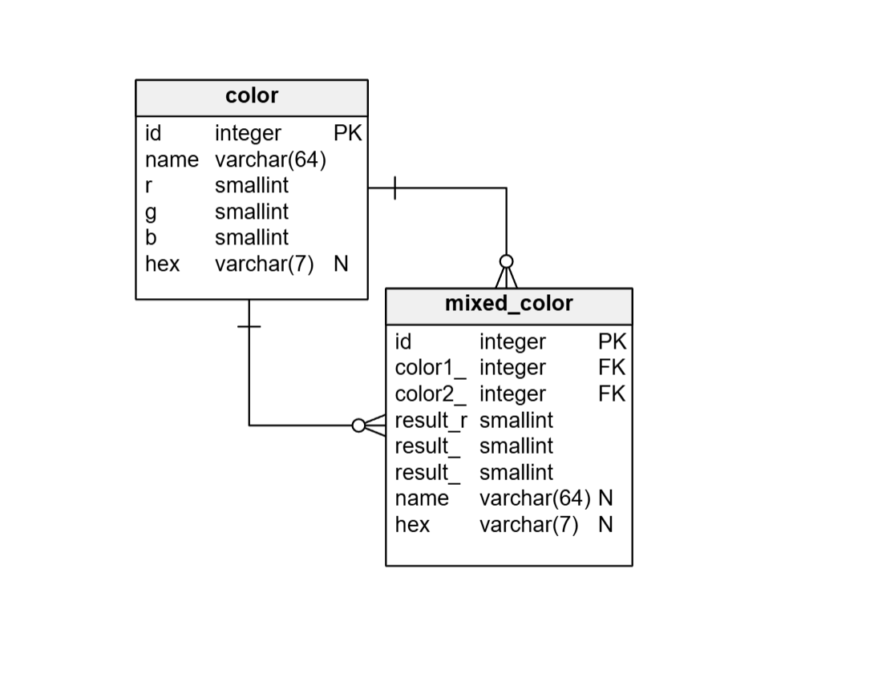
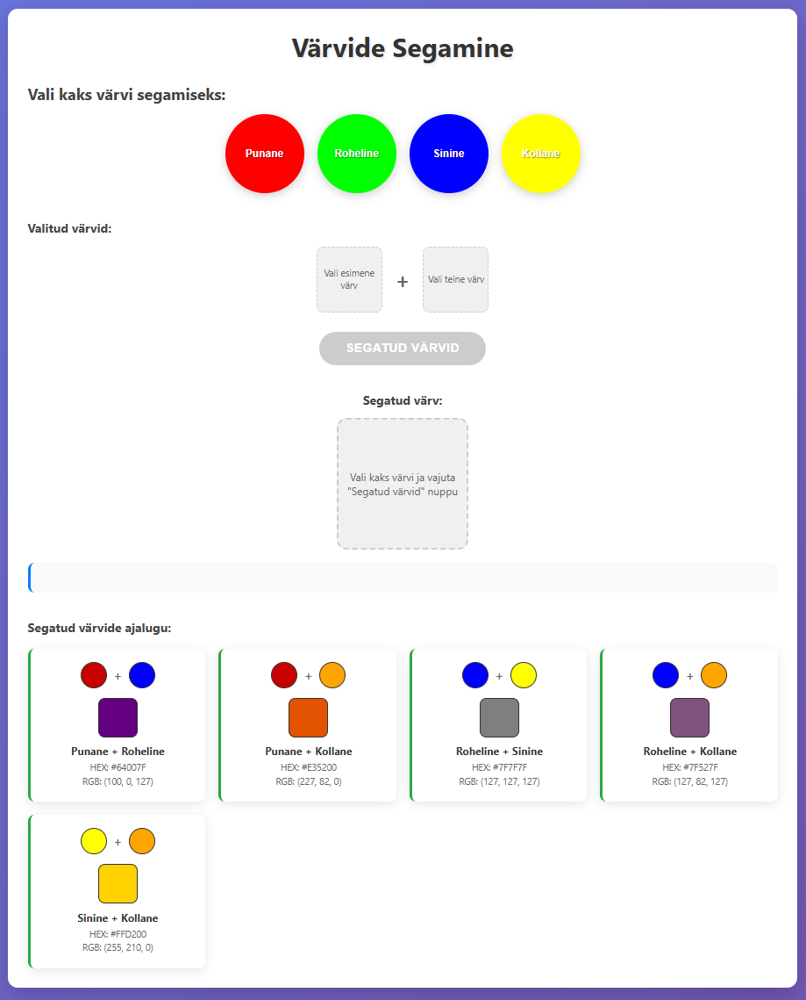

# Värvide CRUD Rakendus

Spring Boot rakendus värvide haldamiseks ja segamiseks HSQLDB andmebaasiga.

## Funktsionaalsus

### Backend API
- **CRUD operatsioonid värvidele** - Loo, luge, uuenda, kustuta värve
- **Värvide segamine** - Segatud värvide salvestamine andmebaasi
- **REST API** - Swagger UI dokumentatsiooniga
- **HSQLDB** - Mälupõhine andmebaas

### Frontend
- **Interaktiivne värvide segamine** - Nelja põhivärvi nupud
- **Reaalajas segamine** - Valides kaks värvi tekib segatud värv
- **Ajalugu** - Kõik segatud värvid kuvatakse allpool
- **Responsive disain** - Mobiilisõbralik

## Tehnoloogiad

- **Backend**: Spring Boot 3.5.5, Java 21
- **Andmebaas**: HSQLDB (mälupõhine)
- **Frontend**: HTML5, CSS3, JavaScript (ES6+)
- **API Dokumentatsioon**: Swagger UI
- **Build Tool**: Gradle

## Käivitamine

### 1. Rakenduse käivitamine

IntelliJ IDEA-s
 - Käivita ColorsApplication.java


### 2. Rakenduse kasutamine
- **Frontend**: http://localhost:8080
- **Swagger UI**: http://localhost:8080/swagger-ui.html


## API Endpointid

### Värvid

- `GET /api/colors/{id}` - Värv ID järgi
- `PUT /api/colors/{id}` - Värvi uuendamine
- `DELETE /api/colors/{id}` - Värvi kustutamine
- `GET /api/colors` - Kõik värvid
- `POST /api/colors` - Uus värv
- `GET /api/colors/debug/all` - Kõik värvid, kompaktselt
- 
### Segatud värvid
- `GET /api/mixed-colors` - Kõik segatud värvid
- `POST /api/mixed-colors` - Uus segatud värv
- `GET /api/mixed-colors/{id}` - Segatud värv ID järgi
- `DELETE /api/mixed-colors/{id}` - Segatud värvi kustutamine
- `GET /api/mixed-colors/by-color/{colorId}` - Segatud värvid konkreetse värvi järgi

## Andmebaasi skeem



### Color tabel
- `id` - Primaarvõti
- `name` - Värvi nimi
- `r`, `g`, `b` - RGB komponendid (0-255)
- `hex` - HEX kood

### Mixed_Color tabel
- `id` - Primaarvõti
- `color1_id`, `color2_id` - Viited põhivärvidele
- `result_r`, `result_g`, `result_b` - Segatud värvi RGB
- `name` - Segatud värvi nimi
- `hex` - Segatud värvi HEX kood

## Frontend kasutamine

1. **Värvi valimine**: Kliki kahte värvinuppu
2. **Segamine**: Rakendus automaatselt arvutab ja salvestab segatud värvi
3. **Ajalugu**: Kõik segatud värvid kuvatakse allpool
4. **Värvi eemaldamine**: Kliki valitud värvinuppu uuesti



## Arendus

### Projekt struktuur
```
src/main/java/ee/bcs/colors/
├── ColorsApplication.java
├── domain/
│   ├── dto/           # Data Transfer Objects
│   ├── entity/        # JPA entiteedid
│   └── service/       # Äriloogika
└── infrastructure/
    ├── config/        # Konfiguratsioonid
    ├── mapper/        # Objektide mappimine
    ├── repository/    # Andmebaasi juurdepääs
    └── rest/          # REST kontrollerid
```

## Troubleshooting

### Rakendus ei käivitu
- Kontrolli, et port 8080 on vaba
- Veendu, et Java 21 on installitud
- Kontrolli Gradle sõltuvused

### Frontend ei tööta
- Kontrolli brauseri konsooli veateadete jaoks
- Veendu, et backend töötab


### Andmebaasi probleemid
- HSQLDB on mälupõhine, andmed kaovad rakenduse taaskäivitamisel
- Kontrolli `schema.sql` ja `data.sql` faile
- Vaata logidest SQL veateadete jaoks


## Testimine POSTMAN-is

Loe juhendit -   *Postman_Test_Guide.md*